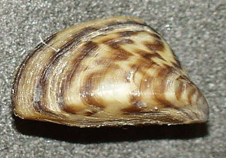

# Understanding the complex dynamics of zebra mussel invasions over several decades in European rivers: drivers, impacts, and predictions
### Senckenberg Research Institute and Natural History Museum Frankfurt
### University of South Bohemia Ceske Budejovice

<strong>Authors</strong>:
Phillip J. Haubrock1,2,3,*, Ismael Soto2, Melina Kourantidou4,5, Danish A. Ahmed3, Ali Serhan Tarkan6, Paride Balzani2, Kristi Bego1, Antonín Kouba2, Sadi Aksu7, Elizabeta Briski8, Francisco Sylvester9, Vanessa De Santis10, Gaït Archambaud-Suard11, Núria Bonada12, Miguel Cañedo-Argüelles13, Zoltán Csabai14,15, Thibault Datry16, Mathieu Floury17, Jean-François Fruget18, J. Iwan Jones19, Marie-Helene Lizee11, Anthony Maire20, John F. Murphy19, Davis Ozolins21, Jes Jessen Rasmussen22, Agnija Skuja21, Gábor Várbíró23, Piet Verdonschot24, Ralf C.M. Verdonschot24, Peter Wiberg-Larsen25, Ross N. Cuthbert26
## Abstract
The zebra mussel Dreissena polymorpha is one of the most successful, notorious, and detrimental aquatic invasive alien species worldwide, having invaded Europe and North America while causing substantial ecological and socio-economic impacts. Here, we investigated the spatiotemporal trends in this species’ invasion success using 178 macroinvertebrate abundance time series, containing 1,451 records of D. polymorpha collected across nine European countries between 1972–2019. Using these raw (absolute) abundance data, we examined trends and drivers of occurrences and  relative abundances of D. polymorpha within invaded communities. Meta-regression models revealed non-significant trends both at the European level and for the majority of the invaded countries, except for France (significant decreasing trend) and Hungary (marginally positive trend). At the European level, the number of D. polymorpha occurrences over time followed a flat-top bell-shaped distribution, with a steep increase between 1973–1989 followed by a plateau phase prior to significantly declining post-1998. Using a series of climatic and hydromorphological site-specific characteristics of invaded and uninvaded sites from two periods (1998–2002; 2011–2015), we found that native richness, alien abundance, distance to the next barrier, and elevation were associated with the occurrence of D. polymorpha. We also found that higher native richness and lower latitude were related to lower relative abundances. Using Cohen’s D as a measure of D. polymorpha impact, we found that biodiversity within the invaded sites was initially higher than in uninvaded ones, but then declined, suggesting differences in biodiversity trends across invaded and uninvaded sites. While our results emphasise the high invasion success of D. polymorpha, increasing stressors within the context of global change—particularly ongoing climate change—are likely to enhance invasion rates and the impact of D. polymorpha in the near future, potentially exacerbated by the lack of timely and effective management actions.

## <a href="https://github.com/IsmaSA/Aquaculture/tree/master/Code">Script:</a>
Code created by: <a href="https://www.researchgate.net/profile/Ismael-Soto-4">Ismael Soto</a>   

[][mail] 

[mail]: mailto:isma-sa@hotmail.com

                                                                                    
 
